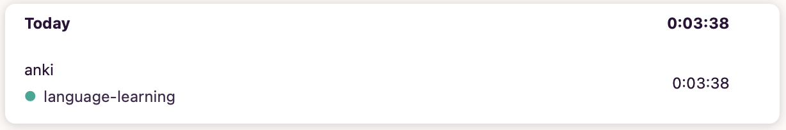

# Anki Toggl

Sync your daily Anki review time to Toggl Track as a single entry.

⚠️🛠️ This add-on is under active development and may introduce breaking changes.

## Toggl Track

<https://track.toggl.com/>

## Get a Toggl API token

1. Open Profile (top right avatar) → scroll to “API Token”.
2. Click “Copy” to copy your token.
3. Paste it into the add-on’s Settings in Anki.
